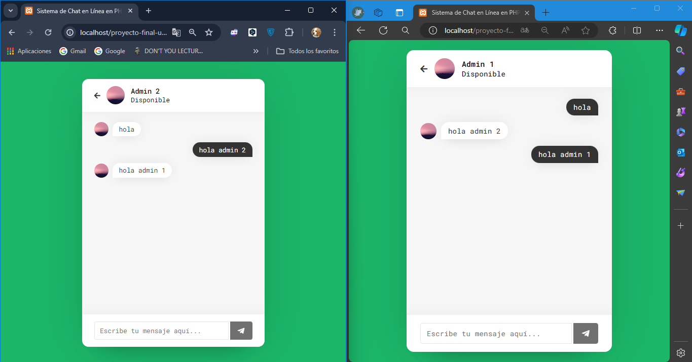

# CHAT EN LINEA EN PHP Y MYSQL

## Live Demo

[Live Demo Link](https://chatenlineaconphpymysql.000webhostapp.com/index.php)

## como probar el proyecto:

1. importe el archivo "chat.sql" a PHPMyAdmin

2. mover la carpeta del proyecto a la siguiente ruta en windows "C:\Xampp\htdocs"
 
3.ingrese a https://LocalHost/proyecto-final-uneweb en su navegador

4. ingrese con los usuarios disponibles, estos siendo:

- admin1@localhost.com
- admin2@localhot.com

**contraseña por defecto de los 2 usuario es: Martina**

## Authors

👤 **Diego Enrique Palmar Montiel**

- GitHub: @DevDPalmar (https://github.com/DevDPalmar)
- Instagram @palmardiego2004 (palmardiego2004)

## Show your support

Give a ⭐️ if you like this project!

## Acknowledgments

- Hat tip to anyone whose code was used
- Inspiration
- etc

## 📝 License

This project is [CC0 1.0 Universal](LICENSE) licensed.
